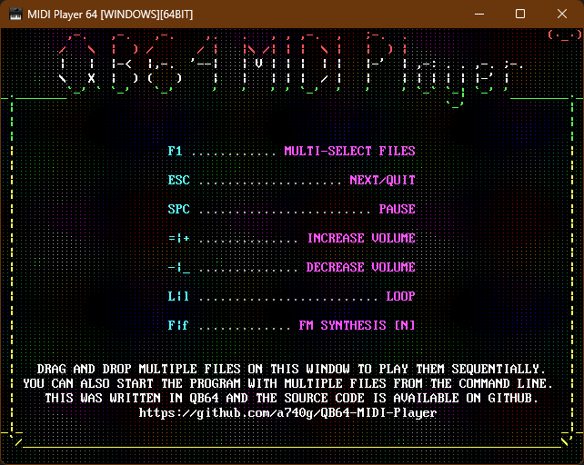
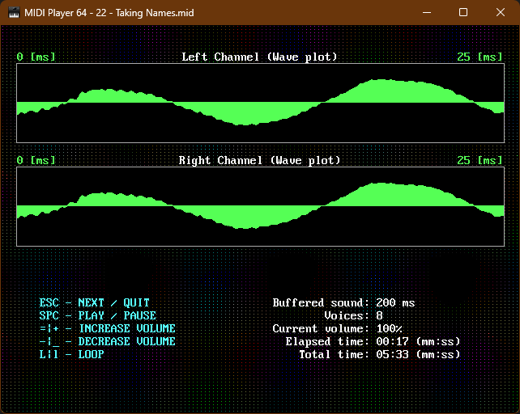

# MIDI PLAYER 64

This is a [QB64-PE](https://github.com/QB64-Phoenix-Edition/QB64pe) compatible MIDI player library based on [TinySoundFont](https://github.com/schellingb/TinySoundFont) (a software synthesizer using SoundFont2) and [TinyMidiLoader](https://github.com/schellingb/TinySoundFont) (a minimalistic SMF parser) C single-header libraries.




## FEATURES

- Easy plug-&-play API optimized for demos & games
- Cross-platform (works on Windows, Linux & macOS)
- Everything is statically linked (no shared library dependency)
- Demo player that shows how to use the library

## API

```VB
Function MIDI_Initialize& (useFM As Byte)
Function MIDI_IsInitialized&
Sub MIDI_Finalize
Function MIDI_LoadTuneFromFile%% (fileName As String)
Function MIDI_LoadTuneFromMemory%% (buffer As String)
Function MIDI_IsTuneLoaded&
Sub MIDI_StartPlayer
Sub MIDI_StopPlayer
Function MIDI_IsPlaying&
Sub MIDI_SetLooping (ByVal nLooping As Long)
Function MIDI_IsLooping&
Sub MIDI_SetPause (isPaused As Byte)
Function MIDI_IsPaused%%
Sub MIDI_SetVolume (ByVal nVolume As Single)
Function MIDI_GetVolume!
Function MIDI_GetTotalTime#
Function MIDI_GetCurrentTime#
Function MIDI_GetActiveVoices~&
Sub MIDI_UpdatePlayer
```

## NOTES

- This requires the latest version of [QB64-PE](https://github.com/QB64-Phoenix-Edition/QB64pe/releases)
- Mixing this with QB64-PE's [$MIDISOUNDFONT](https://qb64phoenix.com/qb64wiki/index.php/$MIDISOUNDFONT) will not work
- When you clone a repository that contains submodules, the submodules are not automatically cloned by default
- You will need to use the `git submodule init` command followed by the `git submodule update` command to clone the submodules

## ASSETS

[Icon](https://iconarchive.com/artist/studiomx.html) by Maximilian Novikov
