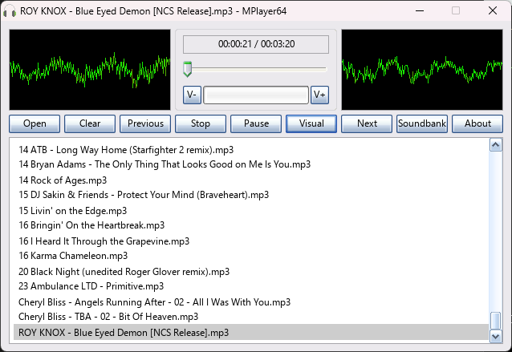

# MIDI PLAYER 64

This is a [QB64-PE](https://www.qb64phoenix.com/) MIDI player and library based on:

- [foo_midi](https://github.com/stuerp/foo_midi) (heavily modified)
- [libmidi](https://github.com/stuerp/libmidi) (modified)
- [Opal](https://www.3eality.com/productions/reality-adlib-tracker) (refactored)
- [primesynth](https://github.com/mosmeh/primesynth) (heavily modified)
- [stb_vorbis](https://github.com/nothings/stb)
- [TinySoundFont](https://github.com/schellingb/TinySoundFont)
- [ymfmidi](https://github.com/devinacker/ymfmidi) (heavily modified to work with **Opal**)

---




## FEATURES

- Multiple synthesizers: **Opal + ymfmidi, primesynth, TinySoundFont & VSTi**
- Multiple MIDI file formats: **MUS, HMI, HMP, HMQ, KAR, LDS, MDS, MIDS, RCP, R36, G18, G36, RMI, MID, MIDI, XFM, XMI**
- Multiple instrument bank formats: **WOPL, OP2, TMB, AD, OPL, SF2, SF3, SFO, SFOGG**
- Easy plug-&-play API optimized for demos & games
- Works on Windows, Linux & macOS (VSTi player is only available on Windows)
- Everything is statically linked (no shared library dependency)
- Demo player that shows how to use the library

## USAGE

- Clone the repository to a directory of your choice
- Open Terminal and change to the directory using an appropriate OS command
- Run `git submodule update --init --recursive` to initialize, fetch and checkout git submodules
- Open *MIDIPlayer64.bas* in the QB64-PE IDE and press `F5` to compile and run
- To use the library in your project add the [Toolbox64](https://github.com/a740g/Toolbox64) repository as a [Git submodule](https://git-scm.com/book/en/v2/Git-Tools-Submodules)

## API

```VB
SUB MIDI_Finalize
FUNCTION MIDI_GetActiveVoices~&
FUNCTION MIDI_GetCurrentTime#
FUNCTION MIDI_GetTotalTime#
FUNCTION MIDI_GetVolume!
FUNCTION MIDI_Initialize%% (useOPL3 AS _BYTE)
FUNCTION MIDI_IsLooping%%
FUNCTION MIDI_IsPaused%%
FUNCTION MIDI_IsPlaying%%
FUNCTION MIDI_LoadTuneFromFile%% (fileName AS STRING)
FUNCTION MIDI_LoadTuneFromMemory%% (buffer AS STRING)
SUB MIDI_Loop (ByVal isLooping AS _BYTE)
SUB MIDI_Pause (state AS _BYTE)
SUB MIDI_Play
SUB MIDI_SetSynth (fileNameOrBuffer AS STRING, synthType AS _UNSIGNED LONG)
SUB MIDI_SetVolume (volume AS SINGLE)
SUB MIDI_Stop
SUB MIDI_Update
```

## NOTES

- This requires the latest version of [QB64-PE](https://github.com/QB64-Phoenix-Edition/QB64pe/releases/latest)
- When you clone a repository that contains submodules, the submodules are not automatically cloned by default
- You will need to use the `git submodule update --init --recursive` to initialize, fetch and checkout git submodules

## ASSETS

[Icon](https://iconarchive.com/artist/studiomx.html) by Maximilian Novikov
